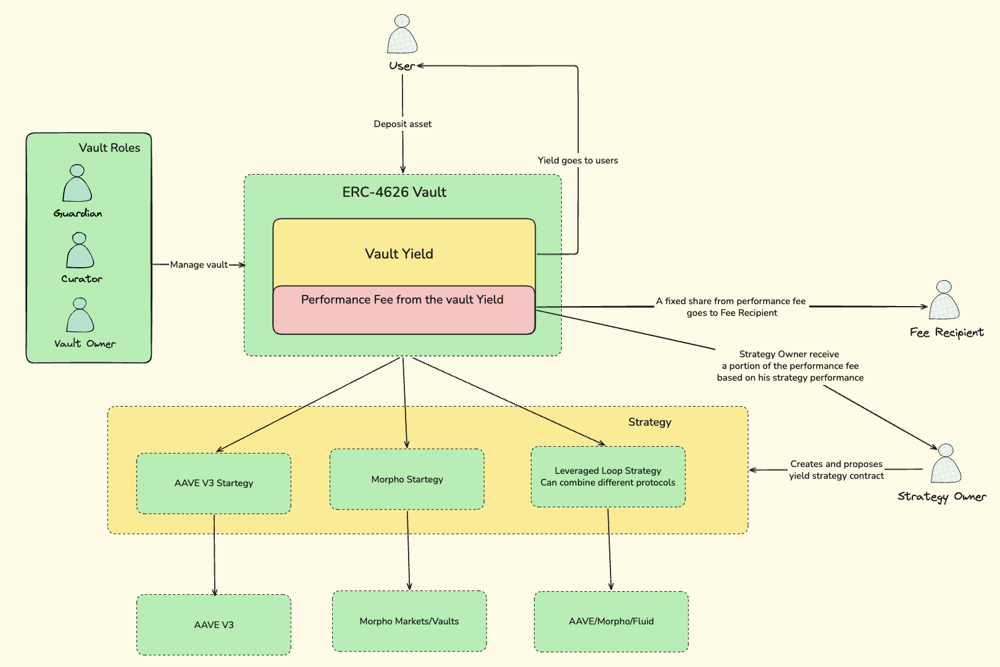

# Strategy Vault

An ERC-4626 yield vault with a **permissionless strategy marketplace**, timelocks for critical actions, role-based access control, gasless deposits and mints via ERC-2612 permit, and a performance fee model that splits yield between the vault protocol and strategy creators.

> **IMPORTANT**:
> - The code isn't audited, keep this in mind.

## Overview

The vault accepts a single underlying asset (for example a stablecoin) and allocates it across multiple yield-generating strategies. Strategy contracts are deployed permissionlessly off-chain; the **curator** decides which ones enter the vault (subject to timelock). **Allocators** configure how deposits and withdrawals are routed across strategies. Depositors receive ERC-4626 shares representing their proportional claim on the vault’s assets (idle balance plus funds deployed per the **supply queue**).

### Key Features

- **Permissionless strategy contracts** - anyone can deploy a strategy implementing `IStrategy` / `BaseStrategy`. Getting it **included** in the vault still requires curator approval and timelock. Strategy creators earn performance-fee shares tied to how much yield their strategy contributes.
- **Morpho-style timelocks** - risk-increasing changes (adding strategies, raising caps, lowering timelock, changing guardian) use submit / wait / accept. The guardian can revoke pending changes. Risk-decreasing updates can apply immediately (for example lowering caps or disabling a strategy).
- **Role-based access** - **owner**, **curator**, **guardian**, and **allocator** (see below). Owner can **pause** the vault in an emergency (`Pausable`).
- **Gasless entry** - `depositWithPermit` and `mintWithPermit` when the underlying asset supports EIP-2612; any address may submit the transaction (typical relayer flow).
- **Performance fee with strategist split** -- no deposit or withdrawal fee. Fee applies only on positive yield, minted as **new shares**. `vaultFeeShare` (BPS) goes to `feeRecipient`; the remainder is allocated to strategy owners in proportion to each strategy’s yield contribution during accrual.

## Architecture



Each vault holds **one underlying asset**. Strategies implement `IStrategy` and inherit `BaseStrategy`, which restricts strategy `deposit`/`withdraw` to the vault. The vault stores per-strategy config (cap, enabled flag, snapshots), maintains **supply** and **withdraw** queues for routing, and aggregates balances in `totalAssets()`. Share --> asset conversion follows ERC-4626 with a **virtual offset** (`_decimalsOffset`) to mitigate first-depositor inflation (see OpenZeppelin ERC-4626 patterns).

## Roles

| Role | Responsibilities |
|------|------------------|
| **Owner** | Protocol settings: curator, allocator allowlist (`setAllocator`), submit guardian (timelocked), submit timelock (timelocked), performance fee, fee recipient, vault fee share, **pause / unpause**. Uses `Ownable2Step` for safe ownership transfer. |
| **Curator** | Risk: `submitStrategy` / `submitStrategyCap` (timelocked where required), `acceptStrategy` / `acceptStrategyCap`, `disableStrategy` (instant when risk is reduced). |
| **Guardian** | Revoke pending timelock operations. Replacing the guardian is itself timelocked. |
| **Allocator** | Operational routing: `setSupplyQueue` and `setWithdrawQueue` (which strategies receive new deposits and which are tapped first on withdrawals). Granted only by the owner. |

## Timelocks

Modeled after MetaMorpho’s `PendingLib` pattern. A global `timelock` duration applies to sensitive actions.

**Three-step flow:**

1. `submit*()` - owner or curator proposes a change; timelock starts.
2. **Wait** - guardian may `revoke*()` to cancel.
3. `accept*()` - anyone may finalize after `validAt`.

**Asymmetric rules:** reducing risk (lower caps, disable strategy, **increase** timelock) can take effect without the full wait where the code paths allow it. Increasing risk (new strategy, higher cap, **decrease** timelock, new guardian) goes through the timelock.

Bounds for timelock and fees are enforced via `ConstantsLib` (`MIN_TIMELOCK`, `MAX_TIMELOCK`, `MAX_FEE`, `MAX_VAULT_FEE_SHARE_BPS`, `MAX_STRATEGIES`).

## Strategy Marketplace

1. A strategy owner deploys a contract extending `BaseStrategy` with `strategyOwner()` returning their address.
2. The **curator** calls `submitStrategy(strategy, strategyCap)` to start timelocked inclusion (or immediate handling when policy allows).
3. After the timelock (if any), `acceptStrategy(strategy)` activates the strategy.
4. The **allocator** sets `setSupplyQueue` and `setWithdrawQueue` so deposits and withdrawals route through the desired strategies and caps.
5. Users `deposit` / `mint`; the vault pushes assets into strategies along the supply queue. Yield is simulated or earned in the live strategy; `_accrueInterest()` attributes fees and updates accounting (`lostAssets`, `lastTotalAssets` where applicable).

## Fees

- No deposit or withdrawal fees.
- Performance fee (`fee`, BPS, capped by `ConstantsLib.MAX_FEE`) applies on **positive yield** only.
- `_accrueInterest()` runs on user entry/exit paths (`deposit`, `mint`, `withdraw`, `redeem`, and permit variants) so share pricing stays consistent.
- Fee is realized as **minted shares**, not asset transfers.
- Split: `vaultFeeShare` (capped by `MAX_VAULT_FEE_SHARE_BPS`) to `feeRecipient`; the rest to strategy owners proportional to per-strategy yield contribution during that accrual.

## Contracts

| Contract | Description |
|----------|-------------|
| `Vault.sol` | Core ERC-4626 vault: strategies, queues, timelocks, roles, fee accrual, permit-based entry. |
| `VaultFactory.sol` | Deploys and indexes vault instances. |
| `BaseStrategy.sol` | Abstract strategy base; vault-only deposit/withdraw hooks. |
| `IStrategy.sol` | Strategy interface and `StrategyConfig`. |
| `IVault.sol` | Vault interface. |
| `IVaultFactory.sol` | Factory interface. |
| `PendingLib.sol` | Timelock primitives (`PendingUint192`, `PendingAddress`). |
| `ConstantsLib.sol` | Fee caps, timelock bounds, BPS, max strategy count. |
| `ErrorsLib.sol` | Shared custom errors. |
| `EventsLib.sol` | Shared events. |
| `MyToken.sol` | ERC-20 with EIP-2612 permit (used in tests and examples). |
| `PermitHash.sol` | **Test helper** library (`src/libraries/test-helper-lib/`) for building permit digests in Foundry tests. |

## Building and Testing

The project uses [Foundry](https://book.getfoundry.sh/).

```bash
# Install dependencies
forge install

# Build
forge build

# Run tests
forge test

# Verbose traces
forge test -vvv
```

### Layout

- `test/unit/` -- Foundry unit tests (`Vault.test.sol`, `VaultFactory.test.sol`, `MyToken.test.sol`, …).
- `test/mocks/` -- `VaultHarness.sol`, `MockStrategy.sol`, etc.
- `test/fuzz/` -- Echidna harness (`VaultEchidna.sol`) and config.

### Echidna (property fuzzing) Still In Development

Optional [Echidna](https://github.com/crytic/echidna) runs multi-transaction property tests against `VaultEchidna` (functions prefixed with `echidna_` must stay true). Config: `test/fuzz/echidna.config.yaml`.

Example (from repo root, after installing Echidna and a matching `solc`):

```bash
echidna test/fuzz/VaultEchidna.sol --contract VaultEchidna --config test/fuzz/echidna.config.yaml
```

## Tech Stack

- **Solidity** 0.8.30
- **Foundry**
- **OpenZeppelin Contracts**
- **Echidna** (optional, for fuzz testing)
